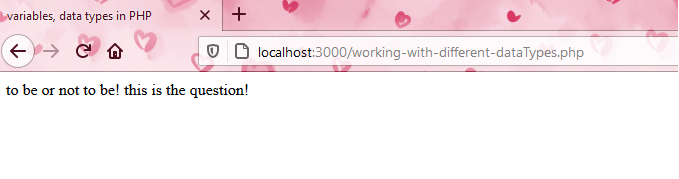
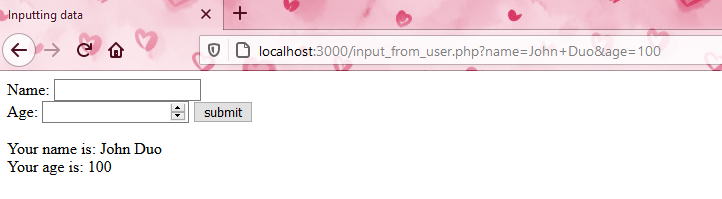
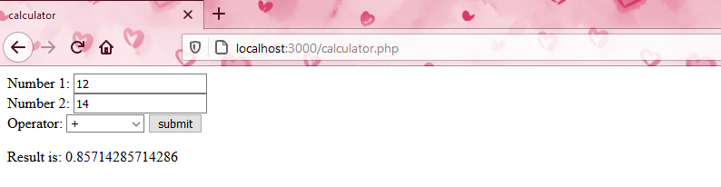
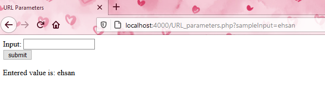

# PHP Quick Review

In this repository, I noted what I reviewed about PHP.


### Installation on Windows

First, I downloaded PHP from php.net then I extracted the files in another folder named php8 and put the folder in my C drive. Then I edited the system environment PATH variable to refer to it. Using the following commands I checked whether I did well.
```bash
$ echo %PATH%
$ php –v
```
Then for text editor, I chose the bracket as my main text editor. I created my first PHP file and observed what happened to try to execute it.
We can create a web server with the following command:
```bash
$ php –S localhost:3000
```
In the address bar of the browser, we have to specify exactly the file which is going to be run, like *localhost:3000/01-hello-world.php*


 
Then we can send HTML elements to the browser with the echo command like what can be seen in the following screenshot.

 
### Variables in PHP:
We declare variables as follows in PHP language:
```PHP
$name = “Ehsan”;
$age = 26;
```
We can use it inside an echo instruction to show them as follows:
```PHP
echo(“My names is $name, and I am $age years old.”);
```
### Data types in PHP
In PHP, programmers do not need to specify the type of the variables. They can easily assign values to their variables. The main data types generally are number, text, and Boolean.
```PHP
$phrase = ”To be or not to be”;
$age = 30;
$gpa = 30.3;
$isMale = false;
```
There are bunch of PHP built-in methods for working with strings like strtolower(), and strtoupper(), strlen(), str_replace(want2replace_string, with_this_string, whole_string), and substr().

```php
$phrase = "To Be or Not to Be! This is the Question!";
echo(strtolower($phrase));
```


 
Also, we can access a specific character of a string by using brackets like what we do in python.
**Note**: if we want to do some specific job, we can simply google for it because we know the fundamentals of programming and do not need to memorize the all functions of PHP language.
Arithmetic operators are like C++ language. In working with numbers some important functions are pow(a, b), sqrt(a, b), max(a, b, …), round(2.2), ceil(2.2), floor(2.2), etc.
### Getting data from the user
We perform this by using form tag. See the following example:
```php
    <form action="input_from_user.php" method="get">
        Name: <input type="text" name="name">
        <br>
        Age: <input type="number" name="age">
        <input type="submit" value="submit">
    </form>
    
        Your name is: <?php
        echo $_GET["name"];
        ?><br>
        Your age is: <?php
        echo $_GET["age"]
        ?>
```
 
 
 
**Note**: For inputting data from the user, it is better to use post method as follows:
```php
    <form action="input_from_user.php" method="post">
        Name: <input type="text" name="name">
        <br>
        Age: <input type="number" name="age">
        <input type="submit" value="submit">
    </form>
    
        Your name is: <?php
        echo $_POST["name"];
        ?><br>
        Your age is: <?php
        echo $_POST["age"]
        ?>
```
As an example, a simple calculator implemented with another tip on how to avoid data loss in the form.


 
 
### URL Parameters: 
are values that we can tack on to the end of one of our URLs, which will pass a value into our PHP program. When we want to use URL parameters, we have to make sure that the method is GET.


 

We use POST method when we do not want the information (like username and password) to be seen in the URL.
### Arrays in PHP: 
Like what we know about arrays in other languages.
```PHP
$friends = array(“Kevin”, “Karen”, “Oscar”, “Jim”, 1, false);
echo $friends;
echo $friends[0];
$friends[2] = “Nothing”;
echo count($friends);
```
For working with checkboxes with multi-select capability, an example is prepared in the source code. The tip is just to use square brackets in the name of the checkboxes.
Associative arrays in PHP are like dictionary structures in Python.
```php
$grades = [“Jim”=>”A+”, “Pam”=>”B-”, “Oscar”=>”C+”];
echo $grades[“Jim”];
echo $grade[“Pam];
```
Function in PHP can be written in the following syntax:
```php
function functionName($arg1, …) {
	function statement 1;
	…
	if(condition) {statement1; ...} else {statement1; ...}
	switch($variable) {
		case “value1”: statement1; ... break;
		case “value2”: statement2; ... break;
		...
		default: statement1: ... break;
	}
	while(condition) {
		statement;
    }
    for ($iterator = 0; $iterator < limit¬; $iterator += N) {
	   statement1;
	   ...
    }
}
```
**Note**: one of the most useful functions is count($array_name) which returns the length of an array.
### Include command
The instruction “include”  allows us to include another file inside our PHP file. One of the instruction’s applications would be having the same header and footer. In this way, we can write a separate file for the header and another one for the footer, then we can just simply include them on every other page.
### OOP in PHP
It is just like other languages and there is not so much difference between them. Just check what is coded in the example codes in the repository.
### Inheritance
With the help of this concept, a class can have the properties of another class. Just follow the example code in the subfolder.
